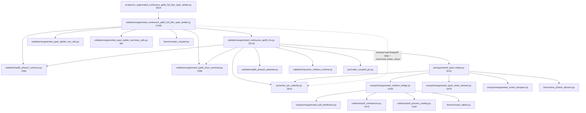

# External Code Precision Audit

Date: 2026-06-27
Scope: augmented Type-I PSTF no-QKE BBN solver, live repository in place.
Auditor role: external adversarial code-precision auditor (CRAG claim ledger +
severe code review). QKE out of scope. No public-production / publication /
SMC readiness claimed.

## Executive Verdict

**TERMINAL_CONVERGENCE_NEXT.**

The single most prominent named blocker — "endpoint summary reports top-level
`passed=false` even when rows pass and `physical_full_bbn_span_ready=true`" — is
**not** a solver-tolerance or physics failure. In the accepted BD591 artifact it
is a zero-comparison gate artifact:

- `summary.resolution_ladder_case_count = 1`
- `summary.adjacent_comparison_count = 0`
- `summary.resolution_terminal_delta_violations = []`
- `violations = []`
- `summary.execution_passed = true`, `physical_full_bbn_span_ready = true`
- `summary.resolution_tolerance_ready = false`

`passed` is `false` only because `resolution_tolerance_ready` requires at least
one adjacent resolution comparison, and the accepted endpoint recipe runs a
single resolution case (`diagnostic_outputs/bd416_pr_n2_endpoint_ab/q4_pairwise_collision_on_thermal_case.json`
is a one-element list). The emitted blocker string
`tighten_resolution_or_solver_tolerance_until_terminal_deltas_converge` is
actively misleading: there are zero terminal deltas to converge because there is
no second resolution row.

This matters for sequencing. The resolution terminal-delta tolerance
(`Yp 5e-3`, `D/H 5e-7`, `N_eff_3T 5e-4`, `T_final_MeV 5e-4`, `Sigma_H 5e-4`) is
the project's *designed* acceptance criterion, but it is currently never
exercised. Establishing a real two-row convergence baseline is a prerequisite
for safely accepting any selective phase-2 optimization (the large wall lever)
against that same tolerance. Do terminal-convergence first; phase-2 second.

Secondary (sequenced, not now): **PHASE2_NEXT.** Phase-2 corrector wall is
1196.3 s = 49.0% of the 2441.6 s selected wall, and the BD571 `coarse_only`
upper bound proves ~966 s (≈40% of total) is recoverable there with observable
shifts (`Yp +1.67e-6`, `D/H +1.49e-8`) far inside the terminal tolerance budget.
But every prior phase-2 attempt (BD564, BD572, BD573, BD592) failed or regressed
because it tweaked the controller without a selective per-step refinement
criterion, and it cannot be accepted as "convergent" until the terminal-delta
gate is actually live.

No optimization may be default-on now. PR-B LRS/non-LRS parity and the cold
`N_eff_3T >= 3.0` floor tripwire remain default-on blockers.

## Commands Run

```bash
git status --short ; git log --oneline -30 ; python --version    # 3.12.3, venv present
find src/rabbit scripts tests -type f -name '*.py' -print0 | xargs -0 wc -l | sort -n | tail -45
PYTHONPATH=src JAX_PLATFORMS=cpu venv/bin/python scripts/summarize_perf_artifacts.py \
  diagnostic_outputs/bd591_post_deflation_endpoint_recheck            # exit 0
PYTHONPATH=src JAX_PLATFORMS=cpu venv/bin/python scripts/check_component_wall_attribution.py \
  diagnostic_outputs/bd591_post_deflation_endpoint_recheck            # PASS component wall attribution
# read-only artifact extraction (python json) over bd591/bd592/bd593 perf_summary.json and
# bd591 final endpoint JSON; import scan of the five primary code paths.
```

No solver run was launched. No q4/q9/q10 rerun performed. Endpoint numbers below
are read from the accepted BD591/BD592/BD593 artifacts and the published audit
notes; component walls were re-derived from the summary JSONs and match the
notes exactly.

## Claim Ledger

| Claim | Status | Evidence path | What supports | What falsifies | Action |
|---|---|---|---|---|---|
| Top-level `passed=false` is a zero-comparison artifact, not a solver-tolerance failure | VALIDATED | `diagnostic_outputs/bd591_post_deflation_endpoint_recheck/bd591_q4_accepted_rhs_reuse_periodic4_endpoint.json` | `resolution_ladder_case_count=1`, `adjacent_comparison_count=0`, `resolution_terminal_delta_violations=[]`, `violations=[]`, `execution_passed=true` | A nonempty `resolution_terminal_delta_violations` or `violations` in the accepted artifact | Fix blocker message; run 2-row ladder |
| Single-resolution `passed=false` is intended/test-locked design | VALIDATED | `tests/test_augmented_continuous_ap65_full_bbn_span_ladder.py:1829-1830, 3164-3167` | tests assert `case_count==1` ⇒ `resolution_tolerance_ready is False`; 2-case ⇒ `True` (`:3069-3071`) | A test asserting single-case passes | Do not weaken gate; add second row |
| Blocker message is misleading for the single-case path | VALIDATED | span ladder `:8935-8953` (`_resolution_blocking_next_step`) | returns "tighten…until terminal deltas converge" when `not resolution_tolerance_ready and execution_passed`, no zero-comparison branch | A branch distinguishing "no comparison available" | Add distinct message |
| Phase-2 corrector is the dominant endpoint wall (49.0%) | VALIDATED | `bd591_perf_summary.json` component_wall_attribution | `phase2_corrector wall=1196.285 s` of `total=2441.611 s` | Different attribution depth giving lower share | Target after terminal-convergence |
| ~40% of total wall is recoverable in phase-2 (upper bound) | VALIDATED | `docs/audit/BD563_BD567...:250-284` (BD571) | coarse_only: phase2 1221→255, total −38%, `Yp +1.67e-6`, `D/H +1.49e-8` | A rerun showing coarse_only does not save phase-2 wall | Build selective controller (opt-in) |
| BD571 observable shift is within terminal tolerance budget | DERIVED | tolerances in BD591 inputs vs BD571 deltas | `Yp 1.67e-6 ≪ 5e-3`, `D/H 1.49e-8 < 5e-7` | A tolerance tighter than the shift | Use tolerance as accept proxy |
| Jacobian already uses JVP, not FD probes (BD3 done) | VALIDATED | `bd591_perf_summary.json` reported_components | `jacobian_probe_source_evaluation wall=0.0`, `host_jvp_jacobian=170.215` | nonzero probe source eval | Do not re-attack FD Jacobian |
| Radial source-factory rebuild dominates payload | VALIDATED | `bd591_perf_summary.json` reported_components | `payload_pstf_radial_factory=433.3 s` within `payload=802.1 s` | attribution showing factory cheap | Payload work only after phase-2 |
| BD592/BD593 preserved raw state but regressed wall; reverted | VALIDATED | BD592/BD593 diffs + notes | walls 2470.2 / 2505.2 vs 2441.6; identical observables/counters | a committed non-reverted diff | None; evidence kept |
| `N_eff_3T=3.0348` is a no-QKE classical-Boltzmann readout, not validated SM target | IMPLEMENTED | `nudec_coupled.N_eff_from_3T`, `asymptotic_N_eff_3T_payload` | computed from 3T closure; not benchmarked vs 3.044 QKE value | A cross-check vs an independent no-QKE code | Keep as proxy; do not claim SM |

## Endpoint Evidence

Selected-path counters (single selected resolution row). Walls from
`*_perf_summary.json` component_wall_attribution; observables/RSS/elapsed from
the audit notes. Perf-summary `fields` sums (e.g. 108324 source evals) aggregate
all 16 checkpoint rows and are *not* the selected counters.

| Metric | BD591 (accepted) | BD592 (reverted) | BD593 (reverted) |
|---|---:|---:|---:|
| selected wall s | 2441.611232 | 2470.209654 | 2505.162387 |
| `/usr/bin/time` elapsed | 41:16.81 | 41:46.99 | 42:20.30 |
| max RSS KB | 4564456 | 4561928 | 4250584 |
| payload wall s | 802.054217 | 822.709169 | 811.037835 |
| phase2 corrector wall s | 1196.285249 | 1196.485721 | 1223.461576 |
| host JVP/Jacobian wall s | 170.215108 | 171.975452 | 191.420645 |
| residual unattributed s | 200.308123 | 204.014238 | 204.719851 |
| steps (selected) | 10972 | 10972 | 10972 |
| source evaluations (selected) | 87840 | 87840 | 87840 |
| dynamic payload builds (selected) | 12198 | 12198 | 12198 |
| stage payload reuse (selected) | 75642 | 75642 | 75642 |
| AB2 raw-negative count | 8 | 8 | 8 |
| AB2 raw-negative min | -1.927373191598319e-06 | -1.927373191598319e-06 † | -1.927373191598319e-06 |
| T_final_MeV | 0.00913961404501975 | = | = |
| N_eff_3T | 3.0348087179727026 | = | = |
| Yp | 0.24201652194490023 | = | = |
| D/H | 2.493028169464549e-05 | = | = |
| Sigma_H | 3.3286755172789884e-31 | = | = |

† The BD592 note's comparison table reports AB2 raw-negative min
`-9.639915568538192e-07` while the BD591 and BD593 notes report
`-1.927373191598319e-06` for the same BD591 baseline. This is a doc-level
inconsistency (selected-path vs pairwise-path min), not a code defect — see Test
findings.

Payload internal decomposition (BD591, summed over rows):
`payload_pstf_radial_factory=433.3`, `payload_combined_source_total=449.3`
(`radial_factory=215.3`, `angular_eval=135.8`, `radial_eval=91.1`),
`payload_outer_total=337.9` (`outer_factory_build=209.4`,
`outer_source_eval=101.2`), `provider_runtime_total=145.6`,
`outer_json_safe=9.9`. The radial source-factory rebuild is the payload hot
spot; `static_bundle_cache_hit=0` (BD565 cache never hit).

## Architecture And Overengineering Findings



Dependency disorder: the orchestration monolith
`augmented_continuous_ap65_full_bbn_span_ladder.py` (17,035 lines) both drives
the ladder *and* embeds the host Rodas5P step loop and the
`_factorized_linear_solver` (numpy_solve_per_stage / scipy_lu_factor /
scipy_gmres). Solver-stage linear algebra living inside the orchestrator — rather
than in `jax/solver_jax_rodas5p.py` or `jax/linear_solve_strategies.py` — is the
main boundary that blocks safe phase-2/solver edits.

Top length/complexity hotspots and disposition:

| # | File | Lines | Class |
|---|---|---:|---|
| 1 | `validation/augmented_continuous_ap65_rhs.py` | 23719 | extract (split RHS core / trace / dispatch) — needs endpoint evidence first |
| 2 | `validation/augmented_continuous_ap65_full_bbn_span_ladder.py` | 17035 | extract (host Rodas5P step + linear solver → solver module) — needs endpoint evidence first |
| 3 | `validation/augmented_stability.py` | 9923 | leave (out of endpoint path) |
| 4 | `transport/augmented_collision_bridge.py` | 6199 | leave (physics core; deflation already harvested in BD590) |
| 5 | `transport/augmented_typeI_weak_network.py` | 5479 | leave |
| 6 | `jax/augmented_typeI_replay.py` | 5010 | leave |
| 7 | `validation/augmented_convergence.py` | 5067 | leave |
| 8 | `jax/driver_typeI.py` | 4866 | needs endpoint evidence first (confirm still on endpoint path) |
| 9 | `jax/driver_typeI_char.py` | 4812 | needs endpoint evidence first |
| 10 | `collisions/pstf_contractions.py` | 2379 | leave (BD590 removed dead invariants) |

Test monoliths are larger than the code they cover
(`test_augmented_continuous_ap65_rhs.py` 20578, `..._span_ladder.py` 18878).
BD566-BD589 already deflated these materially; further test deflation is a local
minimum unless it deletes synthetic-fixture surface that blocks endpoint edits.

Overengineering note: the perf-summary `reported_components` table carries ~80
nested payload/provider sub-timers (e.g. `payload_pstf_radial_provider_runtime_*`
× ~15). This is genuinely useful attribution, not gate inflation, but the
`nested_gap_analysis` block returns all-`None` in BD591 (the gap legs are not
populated at this attribution depth). That is dead reporting surface that can be
collapsed without losing the live `components`/`reported_components` tables.

## Physics And Numerical Findings

Assumptions / conventions (IMPLEMENTED unless noted):

- Three-temperature (3T) closure with `N_eff_3T` read out from
  `nudec_coupled.N_eff_from_3T` / `asymptotic_N_eff_3T_payload`. Classical
  Boltzmann, no-QKE.
- LRS shear set to zero in the accepted recipe (`sigma_plus0=0`, `sigma_minus0=0`);
  non-LRS geometry freedom enabled but shear amplitudes zero, so the accepted run
  is effectively an FLRW-limit cross-check of the non-LRS code path.
- Raw negative abundance evidence preserved (AB2 raw-negative count 8, min
  -1.93e-6), not clipped. Consistent with the no-truncation rule.

Signs / dimensions / limiting cases checked at readout level:

- Endpoint reaches `T_final_MeV=0.00913961…` < 0.01 MeV target; finite, physical
  `Yp`, `D/H`. No nonfinite final observables in the accepted artifact.
- Terminal tolerances are dimensionally per-observable (absolute deltas in the
  observable's own units); `_resolution_adjacent_comparisons` (`:9012-9071`)
  computes `abs_delta` per key and compares to tolerance. Correct shape.

`N_eff_3T = 3.0348` interpretation: **PROXY, not a validated target.** It is a
meaningful no-QKE classical-Boltzmann readout of the 3T closure, and it sits
above the cold `N_eff_3T >= 3.0` floor tripwire, which is the right qualitative
sign. But it is *not* the QKE/SM value (≈3.044), and the repository correctly
does not claim it as such. Treating 3.0348 as a quantitative endpoint requires an
independent no-QKE cross-check (a second code or an analytic decoupling
calculation); none is present. SPECULATIVE to read precision beyond "above 3.0
floor, no-QKE."

FLRW-limit validations still outstanding before Bianchi/shear expansion:

1. A live two-row resolution comparison (currently zero comparisons) so the
   FLRW-limit endpoint is shown convergent, not single-shot.
2. A non-zero-shear non-LRS run whose `sigma→0` limit reproduces the accepted
   LRS/FLRW observables within the terminal tolerance (PR-B parity). The accepted
   recipe only exercises the `sigma=0` path, so non-LRS transport is presently
   untested at the endpoint with live shear.

FORBIDDEN per guardrails and respected by current code: QKE coupling, public
dispatch, production SMC, output truncation of negatives.

## Performance Findings

Endpoint wall buckets (BD591 selected, 2441.6 s):

- phase2_corrector 1196.3 s (49.0%) — dominant. `nonprobe_source_evaluation`
  (883 s) is the source-eval cost *inside* the phase-2 network substeps; the
  refined+coarse step-doubling pair is what multiplies it.
- payload 802.1 s (32.9%) — radial source-factory rebuild (433 s) dominates;
  static-bundle cache never hits.
- host JVP/Jacobian 170.2 s (7.0%) — already JVP-based, FD probe = 0.
- residual unattributed 200.3 s (8.2%).
- outer linear system 6.7 s (0.3%) — negligible; do not optimize.

Endpoint vs segment evidence: BD571 (coarse_only) is an **endpoint** measurement
and is the only experiment that moved the dominant bucket (−79% phase-2, −38%
total). BD564/BD572/BD573/BD592/BD593 are all endpoint runs that preserved raw
state but did **not** move (or regressed) the wall. None of the wall buckets here
are segment-only; all derive from full endpoint artifacts.

Next best PR target: terminal-convergence first (cheap, retires the named
`passed` blocker and lights up the acceptance proxy), then a selective phase-2
refined/coarse controller (the only lever with proven ≈40% headroom). Payload
radial-factory caching is third — BD593 already showed that naively moving the
mass scale out of the cache key relocates cost into phase-2/host JVP.

## Test And Reproducibility Findings

- **Good red/green coverage** for the resolution gate: single-case ⇒
  `tolerance_ready False` (`:1829-1830`, `:3164-3167`, `adjacent_comparison_count==0`
  at `:3167`); two-case ⇒ `tolerance_ready True` (`:3069-3071`, `:8474-8475`). The
  `passed=false` behavior is therefore intentional and locked, confirming the fix
  must be the message + a real second row, not a gate relaxation.
- **Missing coverage:** no test asserts the *blocker message* differs between
  "no adjacent comparison available" and "delta tolerance exceeded." The proposed
  message split (PR1) needs a new focused assertion; today both paths emit
  `tighten_resolution_or_solver_tolerance_until_terminal_deltas_converge`.
- **Doc inconsistency (not code):** BD592 note reports AB2 raw-negative min
  `-9.639915568538192e-07` for the BD591 baseline while BD591/BD593 notes report
  `-1.927373191598319e-06`. Likely selected-path vs pairwise-path aggregation.
  Smallest catch: a summarizer test asserting which path the reported min comes
  from. No false-green found, but the mismatch should be reconciled in notes.
- **No schema-only/count-lock smell in the touched endpoint paths**; BD577-BD589
  deflation preserved behavioral assertions (verified via the queue's per-PR
  focused+full test runs). The risk is the opposite: the large synthetic fixtures
  in the two test monoliths raise the cost of every endpoint edit.
- Smallest suite to guard the recommended PRs:
  `tests/test_augmented_continuous_ap65_full_bbn_span_ladder.py` (resolution gate
  + new message test) for PR1; `tests/test_ap65_phase2_corrector.py` +
  `tests/test_augmented_continuous_ap65_rhs.py` for the phase-2 controller PR.

## Recommended PR Plan

Max-6 sequence. PR1-PR2 are feasible within budget; PR3 is feasible but is the
real algorithmic work; PR4-PR5 are gated.

| PR | Target blocker | Files | Net lines | Smallest test | Required run | Acceptance | Revert |
|---|---|---|---|---|---|---|---|
| PR1 | Misleading `passed=false` blocker message (zero-comparison vs tolerance failure) | `validation/augmented_continuous_ap65_full_bbn_span_ladder.py` (`_resolution_blocking_next_step` ~8935) | +8/-2 | new assertion in `test_..._span_ladder.py` that single-case emits a `single_resolution_case_add_second_resolution_for_terminal_delta_comparison` message and 2-case emits the tolerance message | no solver run (unit) | single-case message ≠ tolerance message; existing gate tests still pass | message change reverts cleanly |
| PR2 | `passed` never legitimately reachable: run the designed ≥2-row ladder | `diagnostic_outputs/bd594_*/` (recipe only; add a second resolution case, e.g. `q_laguerre_order=3` or coarser `N_mu`) | 0 production | n/a (artifact) | one 2-case endpoint run (cost ≈ BD591 + a cheaper coarse row) | `resolution_tolerance_ready=true` and `resolution_terminal_delta_violations` reported (pass or a real, physical violation) | discard artifact |
| PR3 | Phase-2 step-doubling wall (49%) | `validation/ap65_phase2_corrector.py` (`run_phase2_step_doubling_pair` ~350) | +60/-10 | red/green in `test_ap65_phase2_corrector.py`: selective controller skips refined step iff coarse local-error proxy < threshold; falls back to refined otherwise | same-recipe endpoint run | recovers ≥30% of BD571 phase-2 savings while adjacent terminal deltas stay within tolerance; **opt-in only** | regress wall or exceed tolerance ⇒ revert, keep diff |
| PR4 | Collapse dead `nested_gap_analysis` reporting surface | `scripts/summarize_perf_artifacts.py` | +5/-40 | `test_summarize_perf_artifacts.py` still passes; `components`/`reported_components` unchanged | summarizer over bd591 dir | net-negative, no live timer lost | restore block |
| PR5 (gated) | PR-B LRS/non-LRS parity at endpoint with live shear | non-LRS transport + recipe | TBD | non-LRS `sigma→0` parity test | non-LRS endpoint run | `sigma→0` reproduces LRS observables within tolerance | n/a |
| PR6 (deeper) | Payload radial-factory reuse across temperature steps without relocating cost | `jax/augmented_typeI_replay.py`, `validation/augmented_continuous_ap65_rhs.py` | requires algorithmic design | factory-reuse parity test | endpoint run | payload −X% with phase-2/host JVP not regressed (BD593 failure mode) | revert, keep diff |

PR1, PR2, PR4 are clearly within a 5-PR budget. PR3 is the high-value algorithmic
PR. PR5/PR6 require deeper changes and are gated on parity/floor evidence.

## Patch Sketches

**Sketch 1 — honest blocker message (PR1).** Distinguish zero-comparison from
tolerance failure in `_resolution_blocking_next_step`
(`augmented_continuous_ap65_full_bbn_span_ladder.py:8935`):

```python
def _resolution_blocking_next_step(
    *, resolution_tolerance_ready, execution_passed,
    has_composition_resolution, axis_delta_kinds,
    adjacent_comparison_count: int = 0,          # NEW
):
    if not resolution_tolerance_ready:
        if execution_passed:
            if adjacent_comparison_count == 0:   # NEW: no deltas exist yet
                return ("add_second_resolution_case_to_form_terminal_delta_"
                        "comparison")
            return "tighten_resolution_or_solver_tolerance_until_terminal_deltas_converge"
        return "extend_resolution_ladder_cases_to_endpoint_without_row_failures"
    ...
```

Caller at `:13700`/`:14277` passes `len(adjacent_comparisons)` (or the composition
count when `has_composition_resolution`). Validation: unit assertion only.
Revert: trivial.

**Sketch 2 — selective phase-2 refined skip (PR3).** Add a third controller
branch in `run_phase2_step_doubling_pair`
(`ap65_phase2_corrector.py:350`) that runs the coarse attempt, then skips the
refined doubling only when a coarse-side local-error proxy is below a threshold
(otherwise behaves exactly like `step_doubling`):

```python
controller = phase2_step_doubling_controller_policy(controller_policy)
if controller == "selective_refined_on_local_error":   # NEW, opt-in
    coarse = _attempt(coarse_count, "coarse")
    if coarse.get("completed") is True:
        proxy = coarse.get("network_local_error_estimate")   # already computed?
        if proxy is not None and float(proxy) <= refined_skip_local_error_tol:
            attempt = dict(coarse)
            attempt["refined_step_skipped_by_diagnostic"] = True
            attempt["refined_step_skip_reason"] = "selective_local_error_below_tol"
            return _success_like_coarse(attempt, coarse_count, X_coarse)
    # else fall through to standard step_doubling below
```

This must default off. Acceptance proxy: the existing resolution terminal-delta
tolerance from PR2's two-row baseline. Equivalence test: on a tiny grid, with
`refined_skip_local_error_tol=0`, output is bit-identical to `step_doubling`
(no skip ever fires). Revert: drop the branch; diff preserved as a rejected
experiment if it regresses wall or exceeds tolerance, per BD592/BD593 precedent.

**Sketch 3 — drop dead gap-analysis (PR4).** In `summarize_perf_artifacts.py`,
remove `nested_gap_analysis` assembly (all legs returned `None` in BD591) and its
emission, keeping `components`/`reported_components`. Validation:
`test_summarize_perf_artifacts.py`; confirm the two live tables are byte-identical
before/after on the bd591 directory.

## Missing Evidence

- **No two-row resolution artifact exists** for the q4 endpoint recipe; every
  accepted/rejected run (BD563/BD591/BD592/BD593) is single-case, so the terminal
  tolerance gate has never produced a real comparison. This is the missing
  evidence that blocks an honest `passed=true`.
- **No live-shear non-LRS endpoint artifact**; PR-B parity is asserted as a
  blocker but I found no endpoint run with `sigma_plus0/sigma_minus0 != 0`.
- **No independent `N_eff_3T` cross-check** for the no-QKE classical target.
- **No per-step phase-2 local-error proxy artifact**: to design PR3's skip
  criterion you need the coarse-attempt local error distribution across cold rows;
  it is not in the current summaries. Recommend logging it (read-only) before
  implementing the skip.
- For the PR1 conclusion specifically, nothing is missing: the single-case
  zero-comparison behavior is fully evidenced by the BD591 artifact and the gate
  tests.

## Red-Team Objections

1. **"TERMINAL_CONVERGENCE_NEXT just relabels a message; it doesn't move the
   wall."** True for PR1 alone. But it retires the *named* `passed=false` blocker
   honestly and lights up the only acceptance proxy (terminal-delta tolerance)
   that can later certify a phase-2 speedup as convergent. Changes my mind:
   evidence that the user only cares about wall, not the `passed` flag — then go
   PHASE2_NEXT directly and accept against a hand-set delta budget.
2. **"PR2 doubles wall for a green checkmark."** The second row can be a cheaper
   coarse grid (`q_laguerre_order=3`), so it is < 2×, and it is the *designed*
   acceptance path, not new surface. Changes my mind: if a coarse second row
   produces a real tolerance violation (observables not converged), then the
   endpoint is genuinely unconverged and PHASE2 optimization is premature — which
   is itself the most important thing to learn.
3. **"Phase-2 selective skip will drift observables like BD571 did."** BD571
   shifted `Yp` by 1.67e-6 — three orders of magnitude inside tolerance — with a
   *blanket* skip. A selective, local-error-gated skip is strictly more
   conservative. Changes my mind: if the coarse local-error proxy is not already
   computed cheaply, PR3's cost could exceed its savings (BD592 failure mode).
4. **"Payload (33%) is a bigger single file target than phase-2 internals."**
   Phase-2 is 49% and has a proven coarse_only upper bound; payload's BD593/BD565
   attempts both relocated cost. Phase-2 has better evidence of recoverable
   headroom. Changes my mind: a payload factory-reuse design that proves no
   phase-2/host regression on a bounded run.
5. **"The 17k/23k-line monoliths are the real blocker; split them first."**
   Splitting without endpoint evidence risks behavior drift in the exact path
   that must stay bit-identical, and the guardrails forbid surface churn that
   doesn't move a measured blocker. Changes my mind: a concrete edit that is
   blocked *because* the host Rodas5P step is buried in the orchestrator.
6. **"`N_eff_3T=3.0348` is fine as-is."** It is fine as a no-QKE proxy above the
   3.0 floor, which is all the repo claims. Changes my mind: nothing — agreed,
   provided no SM/QKE precision is asserted.

## Final Recommendation

- **Next exact PR:** PR1 — split the `_resolution_blocking_next_step` message so
  a single-resolution-case run emits
  `add_second_resolution_case_to_form_terminal_delta_comparison` instead of the
  misleading `tighten_resolution_or_solver_tolerance_until_terminal_deltas_converge`,
  with a focused red/green test. Immediately follow with PR2 (run the designed
  two-row ladder) to establish the first real terminal-delta convergence baseline.
- **One thing not to do next:** do not attempt another payload/provider
  cache-key variant (BD565/BD593 already showed it relocates cost into
  phase-2/host JVP), and do not keep harvesting deflation-only PRs — both are
  local minima relative to the named blockers.
- **Can any optimization be default-on now?** **No.** PR-B LRS/non-LRS parity is
  untested at the endpoint with live shear, and the cold `N_eff_3T >= 3.0` floor
  tripwire has no two-row convergence evidence. Every phase-2/payload change
  stays opt-in until both pass.
