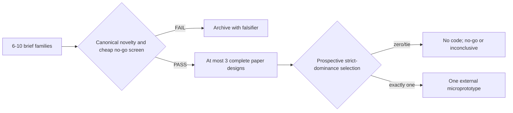
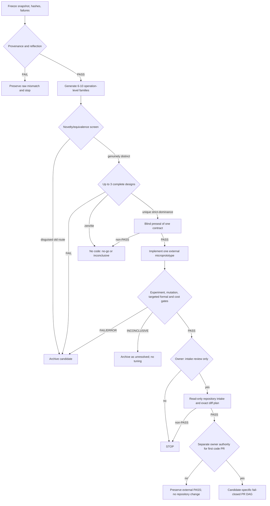

# BD622 D-042 External Executable Breakthrough Candidate Request

Copy this request verbatim to the external auditor. Return one report and, only
for the single finalist defined below, one minimal executable lab bundle.
Owner instruction dated 2026-07-23 explicitly authorized preparing and issuing
this request for new external breakthrough candidates and actual
repository-free, nonphysical experimental code. Receipt of this request
directly from the owner is the authority to author and run only that bounded
external lab. It does not authorize a RABBIT repository change, collision
observable, trajectory, endpoint, unblinding, or production claim.

## 0. Binding state and authority

The current decision is **STOP/PRESERVE**.

- Repository: `/home/cosmosapjw/Dropbox/rabbit/RABBIT_v1.0.5_PRODUCTION`
- Branch: `f10-independent-validation-b3v2`
- HEAD: `bede5a965267ef2dbfc628b56835a3563edf7396`
- Preserved base: `main@ca3a0138d496732edfc13559fd8f7ceec7ef4d6e`
- Current context:
  `f7ab1890ae530c6ba638d7356c1232585ef6c12fbf1d8839d403e374f3423ae3`
- Terminal EXT-01 run:
  `run-20260723-f10-ext01-feasibility-tournament`
- EXT-01 adjudication:
  `18d6449d975f809ab1a3427f497b95711d777648750568ff7d92b6dd96d33df6`

The current gates remain:

- `G-HARNESS-INTEGRITY`: PASS only inside the validated schema-v2
  parent/SubagentStart/SubagentStop boundary;
- `G-EXT-FEASIBILITY`: **FAIL**;
- `G-F10-COVARIANCE-METROLOGY`: **FAIL**;
- `G-F10-INDEPENDENT-FLRW`: **FAIL**;
- `G-F10C1-REGRESSION`: **FAIL**;
- W7 execution/static implementation, B3 collision output, T01--T12, Rust
  production work, Radau, trajectory, endpoint, and unblinding: **FORBIDDEN**;
- F-11/Bianchi, QKE, public runtime, and public production: **FORBIDDEN**.

That owner instruction authorizes only:

1. read-only examination of the supplied repository snapshot and evidence;
2. primary-source CRAG;
3. generation and cheap screening of genuinely new mechanism candidates
   outside the repository;
4. one prospectively sealed manufactured-mechanism microprototype outside the
   repository;
5. claim-dependent exact/formal analysis of that finalist;
6. a runnable external lab bundle that imports no RABBIT implementation and
   produces no physical RABBIT result;
7. a conditional, non-authoritative anti-inflation PR DAG for a later owner
   decision.

Even a completely passing external package may request only
`REQUEST_OWNER_AUTHORIZATION_FOR_ONE_EXTERNAL_CANDIDATE_INTAKE_REVIEW`. It
cannot authorize a PR, implementation, scientific execution, W7, B3, or
endpoint work. The current repository PR queue is empty.

## 1. Immutable evidence and provenance

Recompute every hash before analysis. A mismatch is `PROVENANCE_FAIL`; preserve
the mismatch and stop without repairing or substituting bytes.

| Evidence | SHA-256 |
|---|---|
| `AGENTS.md` | `3a8ab086fdac4c841b0f7cdb68d8167ee5daa2dbec29efe17481a64464e2ce43` |
| anti-drift guardrails | `d74325dbbaa6e176476bc7b7d08143687c2679606cdfe4484780f88deb58072f` |
| cost policy | `9d3680e5f84d561aeccf7401c26ac597a992b1c2cb41402c28f862a02897e149` |
| D-039 request | `2bc4064c848cc94bce58d77a6bbfb403b424411c9985d4a4e0fa0394a778e52a` |
| external report | `1362c9321dd738dd1a8f7c66072d598fea1cecf02cd03f0c15a863571f3659c7` |
| external ZIP | `7a5bb4508142626d1d4c3e97ca9ff2ab5f97cb40c4baea073da45da656ccbf5b` |
| D-040 JAX/Bianchi/DSMC survey | `509c6ead5042ee5af761ad9ecdfd540f20a9bc0414e1defa137249738dd0975e` |
| EXT-01 contract | `9a965f3b5687eb2f326437273667e0f0171172ce04d95db3f53b229b8f2425c2` |
| EXT-01 literature matrix | `1780a7d40279dfc599e8fef94bc5cb73a264a5c4e63f8d25b3e85f51eb3cf3cc` |
| EXT-01 adjudication | `18d6449d975f809ab1a3427f497b95711d777648750568ff7d92b6dd96d33df6` |
| W3 | `a8b76b17540011fca0d3a487132b8809c57c927a7ffdb0b5409b11d246c87b3a` |
| W5 | `83a37543ecbd2dc837f9089d5531d406d836c2b364b46d904cdcfb935b1a0eb0` |
| W6 | `9caaa445f1606d893c5a9a7f226358b17f8a3cedd26664228cd4db0668e0ea94` |
| W7 source | `60fc9668a72bba0ef576138c17b1bfe4f435bc215b8850dde4ac424cdb66dfbe` |
| W7 exact vectors | `e991d415284da9f6d552e6d011739b0948aef03a3a47051e425602fcd3c6e3cd` |
| frozen decisions | `4f4da8f0d5c2d6768affa28254c4cdb2145e65079bb251df9b4621c10606e43b` |
| gate registry | `ed10fd9cb00efb4b48a709ef7a9f3e0188e2a397b65b3c717a7791c1c3eda3b1` |
| claim registry | `53b445c6bc7eae8ee5dea3f3037c4dbd4b96d2243329bf1c15ed79d6e9ea49ee` |

Preserve without editing, adding, deleting, or promoting:

- `.singularhistory`
  (`5abbc84202f8e5354776242626083a79d84e668f9cab6b87030765e6c5f94ae1`);
- `RABBIT_f10_independent_validation_branch_review.md`
  (`a1742101b68649cb42f48ec98a069ea720721dea1a47affbcd1bf1b08c420575`);
- `_independent_noqke.py`;
- all D-027/D-028/D-029 raw and adjudicated evidence;
- the failed B3-v2/W7 and EXT-01 bytes.

Read in this order:

1. `AGENTS.md`, anti-drift guardrails, and cost policy;
2. current context pack, frozen decisions, gate/claim registries, project
   state, decision/claim/validation ledgers, and next-session prompt;
3. D-038, D-039, D-040, and D-041/EXT-01 evidence;
4. W3, W5, W6, W7 source and exact vectors;
5. only then the code consumers and historical evidence needed to test a
   specific novelty claim.

Use this authority order:

`executed code/result > exact source bytes > current SSOT > historical prose >
commit narrative`.

## 2. Required reflection: what failed and why

Do not accept this diagnosis merely because it is supplied. Verify it, give the
strongest countercase, and state the evidence that would reverse each row.

| Route | Bounded progress | Binding failure | Lesson and non-lesson |
|---|---|---|---|
| Fort/history | lower-grid interpolation causality and a zero-step common-FD null were bounded passes | no resolved non-null checkpoint, DLSODA step, mapper/tolerance ladder, endpoint or RABBIT comparison; the signed-over-absolute null becomes direction-dependent `0/0` | do not revive Fort; this is not proof that every spectral method fails |
| D-027 pointwise | direct native evaluation and the common-FD null were executable | non-adjoint target-leg deposition gave self-number `1.9782e-10`, self-energy `2.3350e-10` and electron exchange `1.0684e-7` against `1e-10`, `1e-10`, `1e-8` | pointwise deposition failed; weak/microreversible forms remain possible |
| D-028 GL48 | common-FD null, conservation, first-law and many structural checks passed | native mu--tau covariance `4.666064056497196e-10 > 1e-10`; small-node reconstruction amplified error | W5 localizes amplification but does not prove an exclusive roundoff root |
| D-029 three-node max-entropy | fixed-triple theorem and local binary64 checks | the theorem did not include the state-dependent support selector; continuity/covariance were unclosed | a local theorem cannot authorize a different executable selector |
| B3-v2/W7 | nullspace, entropy affinity, row-ii trace and absolute normalization retained bounded passes | per-leg finite-`m_e` shell, single basis authority, directed tail, event/rounding trace, A0--A4 and consumer completeness failed | source presence and prose clauses are not one compulsory executable graph |
| D-038 process audit | localized current specification-to-executable-contract debt | architecture-first and evidence growth recurred without closing physics | process drift amplified failures but did not cause every scientific defect |
| D-039 external PCR-DG | full-domain compactification and local structure were plausible | no proof of novelty, shell, tail, uniform stability, binary64 or cost closure | a plausible research lead is not an admitted candidate |
| D-039 energy DVM | microreversibility and finite-state entropy were attractive | continuous `m_e/T`, remap, edge-count and anisotropic extension were unclosed | fixed-lattice obstruction is not a universal moving-remap no-go |
| D-041 same-space PCR-DG | five independent exact/formal axes agree | a finite terminal-vanishing span cannot contain exact `1` or `p` | `FAIL-AS-WRITTEN`; it does not kill every distinct-space method |
| D-041 `C-PETROV` | distinct test space and local determinant evade the narrow no-go | no uniform inf-sup, semidiscrete entropy, process-total shell/tail, derivative, binary64 or deletion proof | local nonsingularity is not a candidate-wide theorem |
| D-041 `C-ANALYTIC` | a nonvanishing analytic component evades the same-space theorem | no one-owner representation, unique differentiable map, exact total entropy/tail or non-isomorphism | a second tail/equilibrium authority is forbidden |
| D-041 `C-MEDVM` | moving spacing evades the fixed-lattice sub-no-go | no remap theorem, deterministic sparse edge graph, binary64 or cost proof | current non-admission is not a universal DVM impossibility theorem |
| Harness history | schema-v2 parent/Start/Stop lifecycle now passes | earlier hook and undeclared-write failures affected trust, not the collision mathematics | harness PASS has no scientific implication |
| Legacy JAX | characteristic, angular bookkeeping, AD and factorization clues | incomplete/massless physics, clipping, calibrated closures, past prefactor errors and retired drivers | semantic rederivation only; no JAX forward-development route |
| Conventional DSMC | isotropic FLRW calculations disprove categorical non-convergence | stochastic signed directional moments, derivatives, covariance, stiff feedback and endpoint reproducibility lack economical authority | exclude primary/precision use; static MC/QMC integration checks are a distinct question |

Your reflection must explicitly address these recurring mistakes:

1. bounded subclaim PASS was repeatedly mistaken for whole-design readiness;
2. representation, shell, tail, derivatives and arithmetic were frozen after,
   rather than before, architecture choices;
3. validators existed beside bypassable consumers;
4. local SPD, local entropy, or high-precision agreement was promoted toward a
   uniform binary64 claim;
5. documents, gates, hashes and review surface grew faster than executable
   physics;
6. deletion and permanent-cost plans were aspirational rather than tied to an
   exact diff;
7. candidate repair cycles changed details without proving operation-level
   non-isomorphism to the failed route.

## 3. Objective and required route verdict

Find whether a **materially new operation-level mechanism** can satisfy the
independent static-comparator obligations more economically than another
B3/PCR-DG/DVM repair. Returning no candidate is a successful audit outcome.

Return exactly one route verdict:

- `NO_ADMISSIBLE_CANDIDATE`;
- `ONE_EXTERNAL_CANDIDATE_FOR_INTAKE_REVIEW`;
- `INCONCLUSIVE_EVIDENCE_OR_TIE`;
- `PROVENANCE_FAIL`.

No report/editorial score may be used as a scientific gate.

## 4. Candidate search before implementation

Phase A is report-only. Enumerate **6--10** distinct mechanism families, apply
cheap novelty/no-go screens, and reduce them to at most **three complete
alternatives**. Phase B may implement exactly **one** prospectively selected
finalist. Returning a reasoned no-go before Phase B is a successful outcome.

The following are search seeds, not endorsed candidates. Replace a seed only
when primary evidence supports a stronger operation-level mechanism:

1. `SCKR`: eliminate the event shell into a branch-complete continuous
   coarea/Fredholm kernel;
2. `VCNK`: validate a weighted full-half-line integral equation by a
   Newton--Kantorovich or radii-polynomial argument, not intervals around B3;
3. `FRMP`: use a fermionic reaction-metric discrete-gradient/proximal flow
   whose mobility contains the exact null directions and entropy geometry;
4. `NTSF`: generate a nonnegative stoichiometric factorization directly from
   shell/amplitude definitions rather than compressing an old table;
5. `CVRS`: construct a certified Volterra response series with independent
   continuum kernels and a rigorous remainder;
6. `DHQMC`: use deterministic higher-order QMC on the reaction manifold with
   exact forward/reverse pairing and a prospective variation/discrepancy bound;
7. one literature-backed wildcard that is operation-level distinct;
8. one attractive negative control, such as a finite Mellin--Laplace closure,
   that must be killed if finite-`m_e` support and Pauli products do not close.

Show every elimination:



At least one attractive seed must be deliberately attacked to terminal FAIL.
Do not pad the pool with renamings.

The following do **not** count as new mechanisms:

- Fort revival, pointwise deposition, global GL48/B3 under a basis rename,
  the D-029 selector, same-space PCR-DG, a Petrov restatement, a second analytic
  tail/equilibrium authority, fixed or moving energy DVM without a proved
  remap, conventional DSMC, higher precision alone, more tests, or a compiler
  wrapper without new collision mathematics;
- post-hoc projection, symmetrization, clipping, fitted relaxation,
  output-driven tolerance/grid/cap selection, or a hidden production import;
- a different language, file layout, solver, basis name or diagram with an
  isomorphic operation graph.

For every pool entry provide only:

- `candidate_id`, hypothesis and repository status (`PROPOSED` or
  `SPECULATIVE`);
- continuum and discrete mechanism signature;
- operation-level difference from every failed route above;
- exact shell, tail, invariant, entropy, positivity, covariance, native-map,
  differentiability and native-arithmetic obligations;
- cheapest decisive falsifier;
- smallest allowed external experiment;
- rough code/operation/memory cost;
- terminal archive condition and evidence that could change the verdict.

Only the three complete alternatives add mathematical assumptions, a proposed
operation graph, an explicit coverage map, and a prospective test contract.
Select the finalist before any mechanism result exists by the following
strict-dominance order: fewer unclosed hard obligations, then a stronger
proved stability/error enclosure, then fewer permanent operations, then fewer
authored LOC. If no unique finalist strictly dominates, do not implement one.

## 5. Conjunctive candidate gates

`INCONCLUSIVE` is non-PASS. Vote counts are not evidence. A scientific
feasibility verdict is separate from later repository adoption/deletion.

Before Phase B, write and hash one `EXPERIMENT_CONTRACT.json`. A blind
pre-execution reviewer must accept it before any mechanism output. It freezes:

- the candidate, exact conventions, assumptions, branches and manufactured
  vectors;
- a typed operation graph whose node classes are state representation,
  shell/measure reduction, event or weak-action assembly, invariant/entropy
  enforcement, tail/support authority, derivative construction, consumer
  path, and arithmetic/reduction stage;
- graph equivalence up to identifier renaming, species/leg permutation and
  exact algebraic reassociation that preserves all typed dependencies,
  branches and rounding interfaces; novelty requires non-isomorphism and
  change on at least two node classes, including shell/measure reduction or
  the state-to-collision map;
- a closed dimensionless test domain containing every supplied exact vector,
  threshold/interior/outside-shell cases, mu--tau and leg permutations,
  coalescing/vanishing-density limits, and the full-half-line tail envelope;
- the quotient that removes exact invariant null directions, coordinate
  scaling, norm/dual norm, stability quantity, denominator floor, output
  normalization, operation count, rounding model and deterministic reduction
  order;
- the semantic mutation sites and expected scientific assertions.

If a common domain or any definition cannot be frozen before output, the
candidate is `INCONCLUSIVE`; the author may not choose a favourable domain
afterward.

| Gate | PASS | FAIL |
|---|---|---|
| `XG-00-PROVENANCE` | all binding hashes, preseal chronology and tool versions reproduce | mismatch, substituted bytes or output preceding the seal |
| `XG-01-NOVELTY` | the frozen typed-graph comparison proves the required non-isomorphism | rename, wrapper, compiler-only change or incomplete bidirectional map |
| `XG-02-PHYSICS` | conventions, units, six-species semantics, absolute factors and finite-`m_e` branches close exactly | fitted, massless, incomplete or unresolved branch |
| `XG-03-INVARIANTS` | nullspace, first law, detailed balance and permutation identities hold before floating point | projection, repair or consumer-specific convention |
| `XG-04-ENTROPY-POSITIVITY` | strict-open state and candidate-wide fermionic entropy inequality are proved | clipping, local sign only or missing contraction |
| `XG-05-TAIL-SUPPORT` | one process-total full-half-line authority has a directed enclosure | cutoff/zero extension, second oracle or lost-event ambiguity |
| `XG-06-DERIVATIVES` | deterministic covariance and smooth JVP/Jacobian semantics hold on the seal | stochastic/discontinuous derivative or bypass |
| `XG-07-STABILITY` | the quotient/scaling-defined bound is uniform; condition-based routes satisfy `kappa<=1e6`, while exact/interval routes prove an explicitly equivalent finite enclosure | nullspace-contaminated condition number, samples only or post-output restriction |
| `XG-08-NATIVE-ARITHMETIC` | the sealed native operation graph proves total normalized error `<=2.5e-11` in its declared arithmetic | high-precision agreement alone, unfrozen denominator or missing rounding interface |
| `XG-09-EXECUTABLE` | the one real microprototype, semantic mutants and two clean replays pass | mock/pseudocode, fixture oracle, nondeterminism or nonsemantic kill |
| `XG-10-EXTERNAL-COST` | the complete external prototype stays within the package cap and reports a file-specific permanent-code estimate | hidden/generated authority, favourable range endpoint or missing ownership |
| `XG-11-TRANSFER` | primary sources support the exact borrowed statement and expose every transfer gap | silent promotion from another regime |

Exactly one prospectively selected finalist must PASS all gates to request
intake. Failure archives only that candidate. Provenance/isolation failure
stops the whole package. Zero survivors is `NO_ADMISSIBLE_CANDIDATE`; an
unresolved Phase-A tie is `INCONCLUSIVE_EVIDENCE_OR_TIE`.

## 6. Required executable lab bundle

All code lives outside the repository. It may calculate manufactured
residuals, exact identities, bounds and operation counts, but no physical
RABBIT rate, collision observable, temperature history, abundance, `N_eff`,
trajectory or endpoint.

Use one authority path and at most six authored files:

```text
BD622_D042_breakthrough_lab/
  run_lab.sh
  EXPERIMENT_CONTRACT.json
  mechanism.py
  test_mechanism.py
  proof.<py|wl|lean|v>       # optional, only for the decisive claim
  MANIFEST.sha256
  raw/                       # generated stdout/stderr/results, not authored
```

The optional proof file is claim-dependent: select the CAS or proof assistant
that can decide the finalist's actual bottleneck. Do not replicate five formal
axes as ceremony. Other reviewers may run independent one-line or temporary
CAS checks, but must record exact commands and hashes as review artifacts; they
are not extra package authorities.

Caps are `<=6` authored files, `<=800` authored executable/test/proof LOC and
one implemented finalist. Use a digest-pinned preloaded OCI image with network
disabled, read-only source/root, non-root UID, two CPUs, 4 GiB RAM, 64 PIDs and
30 minutes for the lab command. CRAG and human/agent review time is reported
separately and is outside this 30-minute lab cap. No install, notebook,
generated code authority, duplicate manifest/schema or candidate harness is
allowed.

The only execution command is:

```bash
./run_lab.sh
```

It takes no arguments. Tool/image digests, inputs, thresholds, seeds, mutants
and resource caps are in `EXPERIMENT_CONTRACT.json`; file digests are in
`MANIFEST.sha256`. A missing image/tool or mismatch is `ERROR` without
fallback. Exit codes are `0=finalist pass`, `10=scientific fail`,
`20=inconclusive`, `30=provenance/isolation error`.

Every result row must contain:

```text
candidate_id
gate_id
status: pass|fail|inconclusive|error
exact_command
input_hashes
output_hashes
tool_versions
assumptions
tolerance_or_exact_form
seed
wall_seconds
peak_rss_bytes
finding_ids
raw_failure_path
```

Package-level decisive falsifier: make controlled post-seal scratch copies that
replace the named mechanism symbols with (a) a constant and (b) fixture lookup.
The runner must adapt only scratch-copy digests so each mutant imports and
reaches the same public candidate call. A file/hash/import failure does not
count. Instrumented reachability must show that the candidate symbol executed,
and a preregistered scientific assertion must fail for the expected reason.
If either semantic mutant passes, discard the package as gate-only inflation.

## 7. Mandatory experiment and mutation matrix

Run stages in order: `E0 independent preseal/isolate`, `E1 real-mechanism
reachability`, `E2 claim-dependent exact/formal check`, `E3
property/boundary`, `E4 semantic mutation`, `E5 native metrology/cost`, and
`E6 two fresh-process byte-identical replays plus append-only archival`.
Preserve the first non-PASS and stop Phase B without tuning.

The finalist must run, where applicable:

1. the same-space and fixed-lattice historical negative controls;
2. exact reaction/nullspace and forward/reverse identities;
3. the frozen rational entropy vector and a candidate-wide discrete entropy
   contraction test;
4. manufactured physical-right finite-`m_e` threshold/interior/outside-shell
   cases;
5. full-domain tail integrability and directed-enclosure cases;
6. species, leg and mu--tau permutation metamorphic tests;
7. strict-open state tests with raw invalid-state failure and zero clipping;
8. analytic/generated JVP versus dense finite difference or complex-step on
   smooth manufactured states;
9. adversarial coalescing-node, vanishing-density, threshold and tail families;
   the sealed property generator must cover at least 4,096 deterministic cases;
10. exact/high-precision microcase versus binary64 operation-trace bound;
11. deterministic rerun and input-order permutation checks;
12. the constant/fixture semantic reachability mutants plus targeted mutations
    of normalization, shell branch, reverse orientation, tail ownership,
    reduction order and a consumer bypass;
13. forbidden-import and duplicate-authority scans;
14. exact LOC, file, operation and memory accounting.

A test that merely checks schema shape, file existence, importability or code
coverage does not satisfy a scientific gate. Manufactured tests validate only
the mechanism microcase, never RABBIT physics.

For each terminal failure classify:

`physics | representation | shell/tail | entropy/positivity | derivative |
conditioning | arithmetic | novelty | reproducibility | cost`.

Do not change the candidate, domain, quotient, norm, scaling, mesh, cap,
tolerance or vector after output. A revised candidate needs a new owner-approved
external screen.

## 8. Required independent review and CRAG

Use one evidence mapper and three blind reviews: (1) kinetic
physics/conventions, (2) numerical structure/metrology, and (3) hostile
novelty/cost. For the finalist, add only the exact/CAS/formal axes that can
falsify named claims. Wolfram/xAct, Sage/Singular, SymPy/mpmath, Lean and Rocq
are available, but tool availability is not a reason to run all of them.

Blind reviewers do not read sibling results. At most two cross-steelman
reviewers read designated opposing results; only the adjudicator reads all
normalized results. Review orchestration and prose do not count as blocker
movement.

Every reviewer must perform:

`self-discover -> step-back -> metacognitive self-ask -> CoVe ->
adversarial self-ask -> CCoT -> PDR`.

Expose checkable evidence rather than private chain-of-thought. Require:

- the strongest case for the reviewer's conclusion;
- the strongest opposing steelman;
- a decisive falsifier;
- conditions that would change the verdict;
- stable claim IDs and evidence fingerprints.

Deduplicate by `(claim_id,evidence_fingerprint,verdict)`. Exact contradiction,
branch mismatch or unaligned assumptions yield `INCONCLUSIVE`; majority vote
cannot close a gate.

One reviewer owns web CRAG. For each primary source record:

```text
supported_claim
exact_equation_or_algorithm
uncovered_assumption
nearest_counterexample
transfer_risk
candidate_gate_affected
```

Do not promote classical, nonrelativistic, isotropic, Maxwell--Boltzmann,
fluid-limit or asymptotic results to finite-mass fermionic/Bianchi authority.

## 9. Required exploration and authority DAG

The report must include at least this much branching detail:



Every omitted branch, implicit retry or automatic promotion is a report defect.

## 10. Required anti-drift/anti-inflation PR list

The current repository PR queue is empty. Always return the following
authority skeleton with explicit PASS/FAIL branches, but do not present any
node as queued:

| Conditional node | Entry authority | Required executable movement | PASS | FAIL route |
|---|---|---|---|---|
| `PR-X1-MECHANISM` | one external PASS **plus separate owner design/intake approval** | one private mechanism slice and direct semantic mutation/identity tests | exact microcases pass and no bypass exists | preserve raw failure; archive candidate |
| `PR-X2-STATIC` | separate static-implementation approval | complete catalogue, finite-`m_e` shell, one tail owner and generated derivative | structural physics and static gates pass | no merge; no numerical output |
| `PR-X3-METROLOGY` | X2 PASS | frozen T01--T12, native arithmetic/covariance and full current-tree regression | every command actually runs and passes | `STOP-METROLOGY` or `STOP-REGRESSION` |
| `PR-X4-SEGMENT` | separate segment approval | one blinded SciPy Radau number-of-record segment | refinement, invariants, entropy and trace pass | classify physics/representation/solver; no trajectory |
| `PR-X5-ENDPOINT` | separate endpoint/unblind approval | full blinded FLRW endpoint and independent adjudication | all endpoint gates pass | preserve/reblind; Rust/public work forbidden |

If the verdict is not exactly
`ONE_EXTERNAL_CANDIDATE_FOR_INTAKE_REVIEW`, write
`PR_DAG=UNREACHABLE`, name the blocking gate and stop. Do not invent candidate
files, symbols, deletions or a favourable diff.

If exactly one candidate passes, append a **non-authoritative intake proposal**
for at most five PRs. This is evidence for the next owner decision, not an
implementation queue. Name exact existing files, symbols, consumers, tests and
candidate-owned deletion targets. Mark all LOC/deletion numbers `ESTIMATED`;
only a later real diff can validate them. A missing safe-deletion surface does
not falsify the external mathematics, but it makes repository adoption
`FAIL-COST`.

The conditional proposal must enforce:

- no discovery, prompt, wrapper, manifest, obligation-graph-only or
  documentation-only PR;
- X1 changes executable mechanism code, runs a direct test and consolidates an
  obsolete active surface when safe;
- each later PR moves one named physics, representation, metrology, solver or
  endpoint blocker;
- no public API/runtime flag/backend dispatch/JAX development;
- shared SSOT delta about 20 lines per PR, one result path referenced by hash;
- `net_lines<=80` preferred; `81..200` needs direct evidence; `201..400` needs
  hard-blocker movement or larger deletion; `>400` fails unless safe executable
  deletion is larger;
- cumulative `net<=-1000` is an adoption objective to validate from actual
  diffs before static promotion, never an external scientific PASS criterion;
- a failed PR is not merged and no sibling candidate is auto-promoted.

For every reachable PR provide:

```text
pr_id
named_blocker
exact_existing_files_and_symbols
code_change
deleted_or_consolidated_surface
pre_registered_commands
pass_gate
fail_gate
rollback_or_archive_route
owner_gate_before_and_after
added_lines_estimate: ESTIMATED
deleted_lines_estimate: ESTIMATED
net_lines_estimate: ESTIMATED
permanent_files_added
runtime_behavior_changed
physics_behavior_changed
expected_blocker_movement_ratio
validation_strengthened
cost_effectiveness_verdict
```

Include a Mermaid PR DAG with explicit FAIL and INCONCLUSIVE routes. Design
PASS cannot authorize static output; static PASS cannot authorize Radau;
segment PASS cannot authorize endpoint; endpoint PASS cannot authorize Rust
adoption or public claims.

## 11. Required output package

Return exactly:

1. one self-contained report;
2. one ZIP containing the minimal lab package;
3. one SHA-256 manifest covering every returned file;
4. exact stdout/stderr and raw failures from the frozen commands.

The report must contain:

- verified snapshot, hashes, tools, versions and commands;
- the evidence-based failure reflection and strongest challenge;
- a 6--10-row candidate pool and operation-level novelty matrix;
- cheap kill-test results and reasons for every elimination;
- complete paper contracts for no more than three alternatives;
- the presealed contract, exact code inventory and raw results for at most one
  microprototype;
- independent-review, steelman, CRAG and formal/CAS adjudication;
- deduplicated findings and candidate/gate verdicts;
- `PR_DAG=UNREACHABLE` or the conditional five-PR intake proposal and DAG;
- limitations, claims to weaken, and named evidence that could strengthen them;
- exactly one next owner choice.

Use repository claim vocabulary. External code that ran may be `IMPLEMENTED`
and its manufactured microcase may be `VALIDATED`, but applicability to RABBIT
remains `PROPOSED` or `SPECULATIVE`.

End with exactly one:

- `DO_NOT_REOPEN`;
- `REQUEST_OWNER_AUTHORIZATION_FOR_ONE_EXTERNAL_CANDIDATE_INTAKE_REVIEW`.

The second choice is allowed only when exactly one candidate passes every gate.
It is not implementation authority.

## 12. Mandatory accounting

Report actual values:

```text
added_lines:
deleted_lines:
net_lines:
files_touched:
token_use_exact: UNAVAILABLE — no reliable stage-scoped counter
token_use_basis: harness/API exposes no reliable per-stage counter
runtime_behavior_changed:
physics_behavior_changed:
known_blocker_reduced:
blocker_movement_ratio:
validation_strengthened:
cost_effectiveness_verdict:
```

External discovery with no admitted candidate has achieved scientific
`blocker_movement_ratio=0.00`; do not credit documentation or code volume.
A failed experiment may earn only a separately justified stop-loss or
failure-localization value. Never end with a generic request to continue
research.
